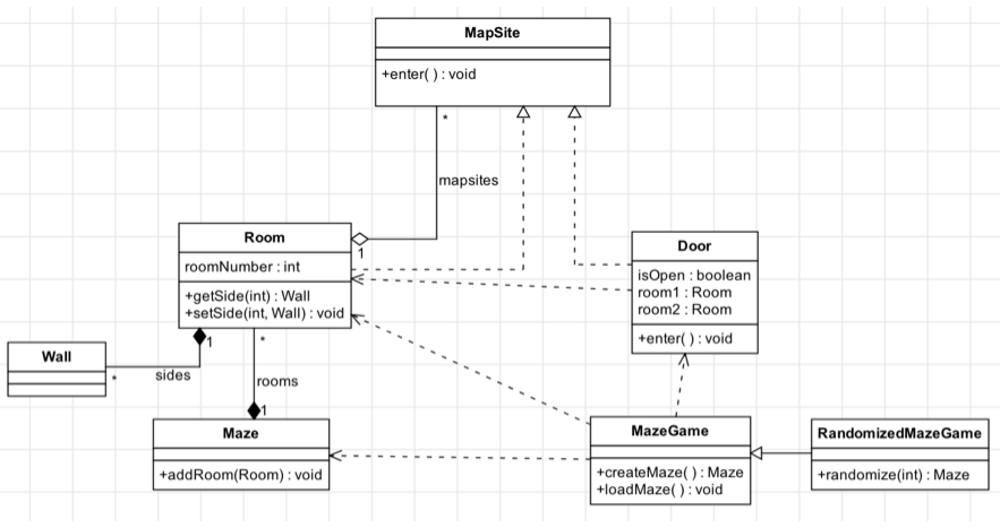

# Homework 7 - UML

In this assignment you will implement a design that is specified using a UML class diagram.

In completing this assignment, you will:

- Gain more experience understanding how a class design is represented in UML
- Apply what you have learned about converting a UML class diagram to Java code

## Background
The UML class diagram below represents a game involving mazes that consist of rooms:

## Activity
Implement the design in Java by creating classes according to the class diagram and following these guidelines:

- You do not have to actually implement the methods and game logic, of course, but your code must compile: you can have methods return null as needed.
- You do not need to worry about any sort of main method or other classes/methods; just represent the classes as shown above.
- All fields and methods should be public (that’s what the little plus-sign next to the method names indicates). You do not need to worry about getters and setters.
- All classes and interfaces must be public.
- All concrete classes should have a no-argument constructor.
- Use arrays to implement multiplicity, e.g. if class Person has a “zero or more” relationship with class Pet, represent it as a Pet[ ] field in Person (as opposed to, say, a List<Pet> or Set<Pet>)
- MapSite should be an abstract class with a concrete “enter” method that does nothing.
- All classes must be in the default package, i.e. there should be no “package” declaration at the top of the source code.

