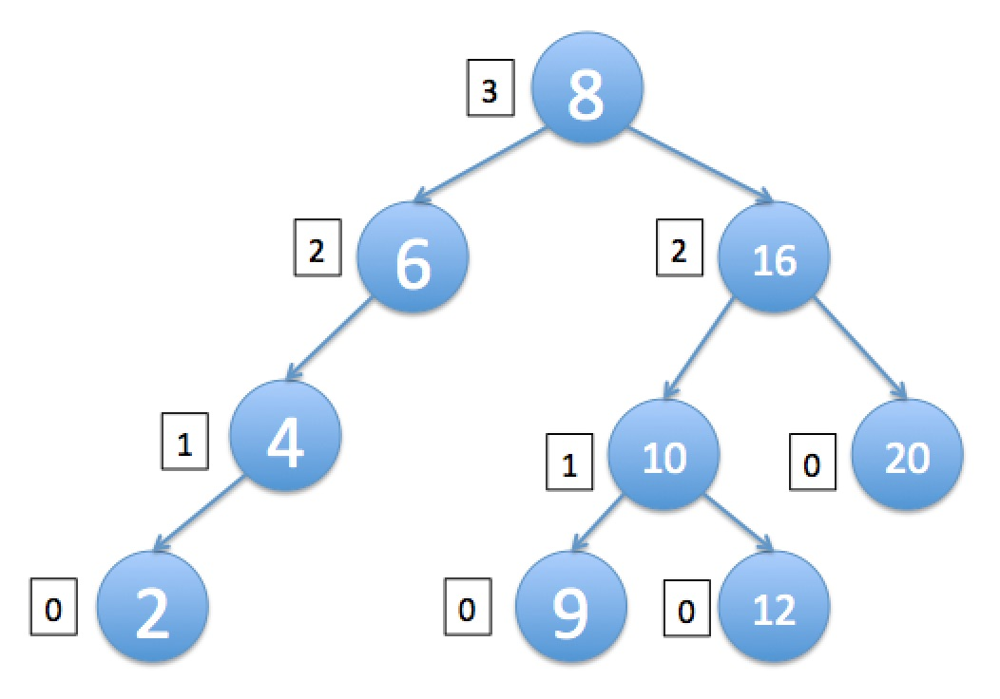

# Homework 4 - Binary Search Trees
This assignment asks you to use and modify a binary search tree (BST) implementation in order to determine whether a tree is balanced.

In completing this assignment, you will:

- Apply what you have learned about how binary search trees represent and store data
- Implement tree traversal algorithms for determining the structure of a tree
- Gain an understanding of additional tree-related concepts

## Background
As seen in the lessons, it is important for a BST to be balanced so that its operations can be O(log n) and that it does not devolve into a LinkedList, for which most operations are O(n).

In the lesson, we saw the use of a self-balancing implementation known as a Red-Black Tree; in this part of the assignment, you will implement a different approach to determining whether the BST is balanced.

## Getting Started
Start by downloading [BinarySearchTree.java](https://prod-edxapp.edx-cdn.org/assets/courseware/v1/db9a2ce3b88f6ff73fc23837897a29a7/asset-v1:PennX+SD2x+2T2017+type@asset+block/BinarySearchTree.java).

In the recent lessons, we implemented a tree in which the nodes had **int** elements. Here, we have provided you with a **generic** implementation of the BinarySearchTree. You will see that nodes have elements of any type **E**, and that we have replaced the **int** comparators (e.g. >, <, ==, etc.) with the Java Object’s **compareTo** function. This allows us to create a BST where the Nodes are any type of object.

The implementation that we have provided ensures that all elements in the tree are distinct, i.e. have different values.

## Activity
First, implement the **findNode** method in **BinarySearchTree.java**. Given a value that is stored in the BST, it returns the corresponding Node that holds it. If the value does not exist in this BST, this method should return null.

Then, implement the **depth** method. Given a value, this method should return the “depth” of its Node, which is the number of ancestors between that node and the root, including the root but not the node itself. The depth of the root is defined to be 0; the depth of its two children (if any) is defined to be 1; the depth of the root’s grandchildren (if any) is defined to be 2; and so on. If the value is null or does not exist in this BST, this method should return -1.

Next, implement the **height** method. Given a value, this method should return the “height” of its Node, which is the greatest number of nodes between that node and any descendant node that is a leaf, including the leaf but not the node itself. The height of a leaf node (i.e., one which has no children) is defined to be 0. If the input value is null or does not exist in this BST, this method should return -1.

The image below shows a binary search tree with the height of each node indicated to its left:

In the diagram above, the height of the node labeled 6 is 2, because there are two other nodes (labeled 4 and 2) from that node to a leaf, which is labeled 2. The height of the node labeled 16 is 2, because the maximum number of nodes between it and a leaf is 2; note that we don't consider the leaf labeled 20 because we're looking for the maximum number of nodes to a leaf.

Next, implement the **isBalanced(Node)** method. Given a Node, return true if the absolute value of the difference in heights of its left and right children is 0 or 1, and return false otherwise. If the Node is null or does not exist in this BST, this method should return false.

As an example, in the diagram above, the node labeled 16 should be considered balanced, since the height of its left child (labeled 10) is 1, and the height of its right child (labeled 20) is 0, and |1 - 0| <= 1.

Note that if a Node's child is null, then the height of that child should be considered as -1. In the diagram above, the node labeled 6 should not be considered balanced, because its left child (labeled 4) has a height of 1, and its right child is null, meaning its height is -1. Since the difference is |1 - (-1)| = 2 and that is greater than 1, this node should be considered unbalanced.

Finally, implement **isBalanced()** so that it returns true if _isBalanced(Node)_ returns true for _all_ Nodes in the tree. This method then allows the user of the BST to determine whether the BST is balanced, using the methods you’ve implemented above. Note that the root being balanced does not imply that the entire tree is balanced (see hint below).

Please do not change the signatures of these five methods, and do not create any additional .java files for your solution. You can, of course, add to or modify the _BinarySearchTree_ class and the inner _Node_ class if you’d like, but if you need additional classes, please define them in _BinarySearchTree.java_. Also, please make sure your _BinarySearchTree_ class is in the default package, i.e. there is no “package” declaration at the top of the source code.